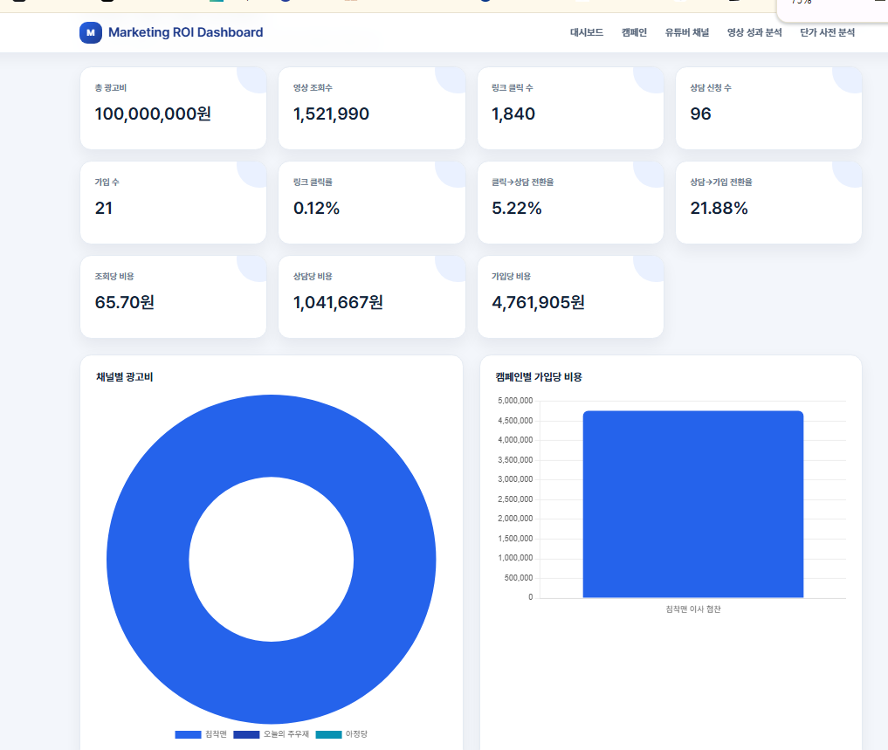
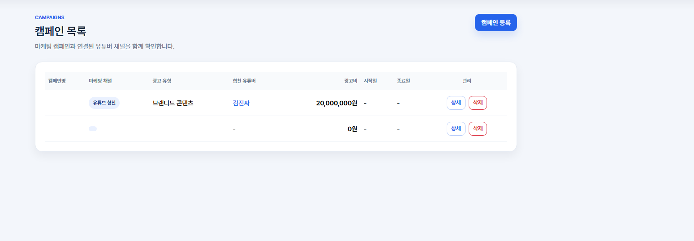
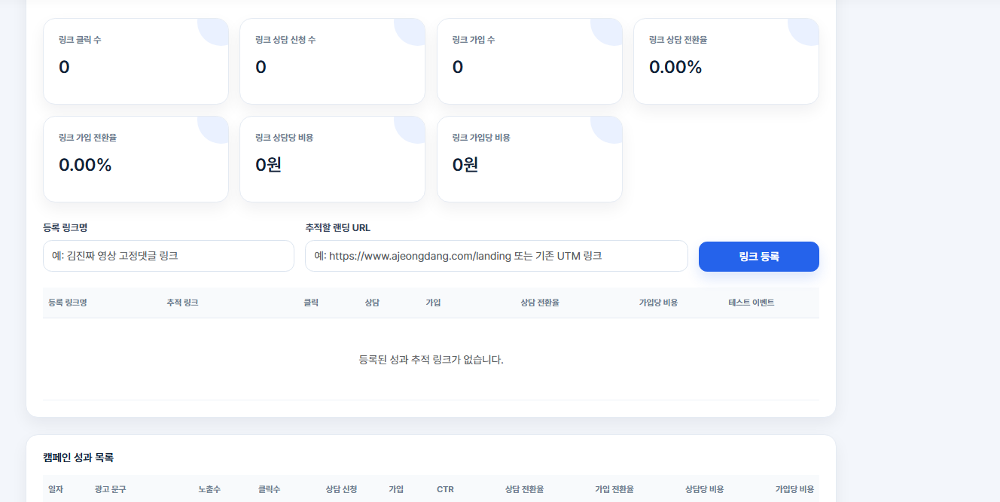
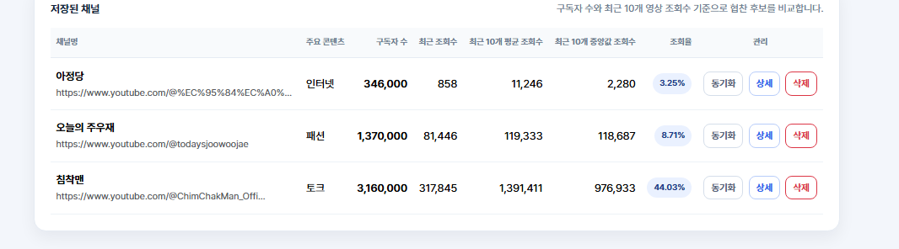
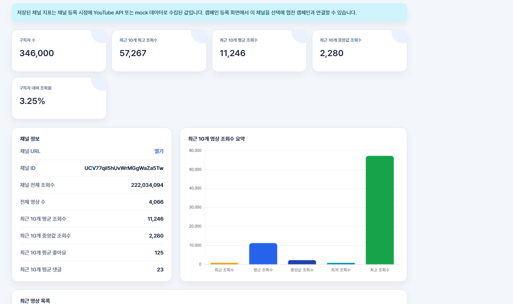
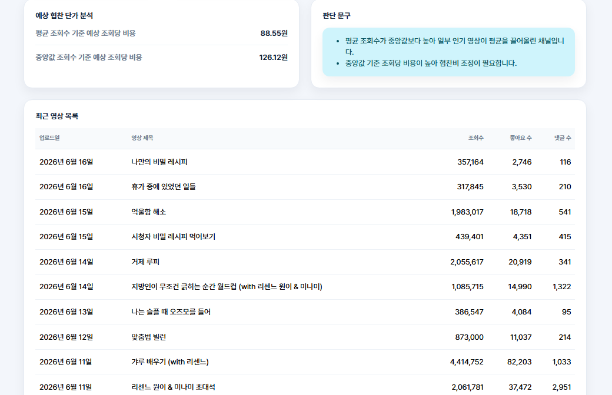
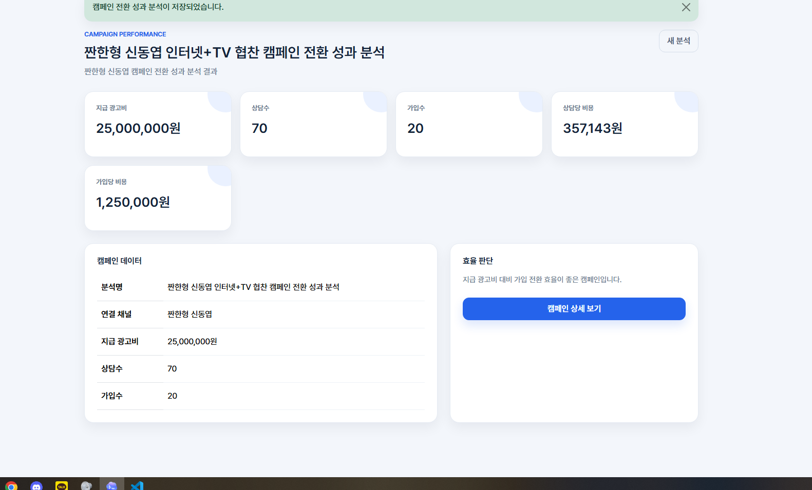
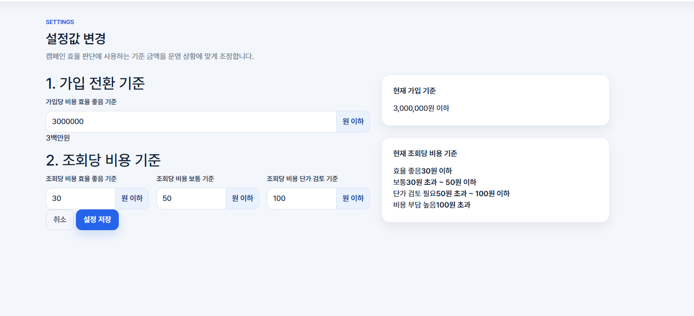

# 마케팅 자동화 프로젝트

생활서비스 기반 유튜브 협찬 마케팅 자동화 포트폴리오 프로젝트입니다.

인터넷, TV, 렌탈, 휴대폰, 이사 등 생활서비스를 상담 기반으로 연결하는 회사에서 유튜브 협찬 캠페인이 실제 상담 신청과 가입으로 이어졌는지 확인하기 위한 내부 마케팅 분석 대시보드입니다.

## 프로젝트 목적

유튜브 협찬 마케팅은 채널 섭외, 단가 검토, 캠페인 등록, 성과 확인 과정이 반복적으로 발생합니다.

이 프로젝트는 유튜브 채널 URL만 입력하면 YouTube Data API로 구독자 수와 최근 영상 조회수를 자동 수집하고, 캠페인 광고비와 내부 상담/가입 데이터를 연결해 협찬 효율을 판단할 수 있도록 만든 업무 자동화형 웹 서비스입니다.

## 핵심 기능

- 유튜버 채널 관리
- YouTube Data API v3 기반 채널 지표 자동 수집
- 최근 10개 영상 조회수, 평균 조회수, 중앙값 조회수, 좋아요, 댓글 수 저장
- 캠페인 등록 시 저장된 유튜버 채널 연결
- 캠페인별 광고비, 상품/서비스, 광고 유형, 상태 관리
- 캠페인별 성과 추적 링크 등록
- 링크 클릭, 상담 신청, 가입 이벤트 집계
- 캠페인 전환 성과 분석
- 가입당 비용 기준 효율 판단
- 조회당 비용 기준 효율 캠페인 / 비효율 캠페인 TOP 5 표시
- 운영자가 효율 판단 기준값을 직접 변경하는 설정 화면
- Bootstrap 기반 관리자 대시보드 UI

## 화면별 기능

### 1. 대시보드



대시보드는 유튜브 협찬 캠페인의 전체 운영 현황을 한 화면에서 확인하는 메인 화면입니다.

주요 기능:

- 등록된 유튜버 채널 수 확인
- 진행 중인 캠페인 수 확인
- 단가 분석 기록 수 확인
- 성과 추적 링크 수 확인
- 조회당 비용 기준 효율 캠페인 TOP 5 확인
- 조회당 비용 기준 비효율 캠페인 TOP 5 확인
- 캠페인별 유튜버, 상품, 상태, 광고비, 최근 10개 평균 조회수 확인
- 캠페인별 조회당 비용 확인
- 캠페인별 링크 클릭, 상담, 가입 성과 확인
- 유튜버 후보 TOP 5 확인
- 최근 단가 사전분석 기록 확인

이 화면은 단순 통계 합산보다 캠페인별 협찬 단가와 성과를 비교하는 데 초점을 맞췄습니다.

### 2. 캠페인 목록



캠페인 목록에서는 등록된 유튜브 협찬 캠페인을 표 형태로 관리합니다.

주요 기능:

- 캠페인명 확인
- 마케팅 채널 확인
- 광고 유형 확인
- 협찬 유튜버 확인
- 광고비 확인
- 캠페인 상세 이동
- 캠페인 삭제
- 캠페인 등록 화면 이동

캠페인별로 어떤 유튜버와 어떤 상품을 협찬하고 있는지 빠르게 확인할 수 있습니다.

### 3. 캠페인 상세



캠페인 상세 화면에서는 하나의 협찬 캠페인에 대한 기본 정보와 성과 추적 데이터를 확인합니다.

주요 기능:

- 캠페인명 확인
- 상품/서비스 확인
- 광고 유형 확인
- 광고비 확인
- 캠페인 상태 확인
- 협찬 유튜버 채널 확인
- 캠페인 메모 확인
- 링크 클릭 수 확인
- 링크 상담 신청 수 확인
- 링크 가입 수 확인
- 링크 상담 전환율 확인
- 링크 가입 전환율 확인
- 링크 상담당 비용 확인
- 링크 가입당 비용 확인
- 성과 추적 링크 등록
- 추적 랜딩 URL 등록
- 테스트용 상담 이벤트 추가
- 테스트용 가입 이벤트 추가

성과 추적 링크는 유튜버 영상 고정댓글, 더보기, 커뮤니티 게시글 등에 넣는 URL을 캠페인 기준으로 관리하기 위한 기능입니다.

### 4. 유튜버 채널 관리



유튜버 채널 관리 화면에서는 협찬 후보 또는 협찬 대상 유튜브 채널을 등록하고 비교합니다.

주요 기능:

- 유튜브 채널 URL 등록
- 채널명 등록
- 주요 콘텐츠 등록
- 채널명 / 주요 콘텐츠 검색
- 구독자 수 확인
- 최근 10개 평균 조회수 확인
- 최근 10개 중앙값 조회수 확인
- 구독자 대비 조회율 확인
- YouTube API 기준 채널 지표 동기화
- 채널 상세 이동
- 채널 삭제

마케팅 담당자가 협찬 후보를 비교할 때 필요한 기본 데이터를 한곳에 모아 관리할 수 있습니다.

### 5. 유튜버 채널 상세



유튜버 채널 상세 화면에서는 특정 채널의 상세 지표와 최근 영상 목록을 확인합니다.

주요 기능:

- 채널명 확인
- 주요 콘텐츠 확인
- 채널 URL 바로가기
- 구독자 수 확인
- 최근 10개 최고 조회수 확인
- 최근 10개 평균 조회수 확인
- 최근 10개 중앙값 조회수 확인
- 구독자 대비 조회율 확인
- 채널 전체 조회수 확인
- 전체 영상 수 확인
- 최근 10개 평균 좋아요 수 확인
- 최근 10개 평균 댓글 수 확인
- 최근 10개 영상 조회수 차트 확인
- 최근 영상별 업로드일 확인
- 최근 영상별 제목 확인
- 최근 영상별 조회수, 좋아요 수, 댓글 수 확인
- 연결된 캠페인 확인

유튜버를 컨택하기 전에 조회수가 안정적인지, 평균과 중앙값 차이가 큰지, 최근 영상 반응이 어떤지 검토할 수 있습니다.

### 6. 캠페인 협찬 단가 사전 분석



단가 사전 분석은 캠페인과 예상 협찬비를 기준으로 유튜버 채널의 예상 조회당 비용을 계산하는 화면입니다.

주요 기능:

- 캠페인 선택
- 예상 협찬비 입력
- 연결된 유튜버 채널 기준 분석
- 채널 기본 정보 확인
- 최근 평균 조회수 확인
- 최근 중앙값 조회수 확인
- 구독자 대비 조회율 확인
- 평균 조회수 기준 조회당 비용 계산
- 중앙값 조회수 기준 조회당 비용 계산
- 최근 영상 목록 확인
- 분석 판단 문구 확인
- 과거 단가 분석 기록 저장

협찬 제안 전에 “이 금액이 조회수 대비 비싼지”를 빠르게 판단할 수 있도록 만든 기능입니다.

### 7. 캠페인 전환 성과 분석



캠페인 전환 성과 분석은 협찬 이후 내부 상담수와 가입수를 기준으로 실제 전환 효율을 계산하는 화면입니다.

주요 기능:

- 캠페인 선택
- 캠페인 광고비 자동 반영
- 성과 추적 링크 기준 상담수 자동 반영
- 성과 추적 링크 기준 가입수 자동 반영
- 내부 상담수 직접 입력
- 내부 가입수 직접 입력
- 지급 광고비 확인
- 상담수 확인
- 가입수 확인
- 가입당 비용 계산
- 가입당 비용 기준 효율 판단
- 캠페인 상세 화면 이동

조회수 중심의 사전 분석과 달리, 이 화면은 실제 상담/가입 성과를 기준으로 캠페인을 평가합니다.

### 8. 설정값 변경



설정값 변경 화면에서는 효율 판단 기준을 운영자가 직접 변경할 수 있습니다.

주요 기능:

- 가입당 비용 효율 좋음 기준 변경
- 조회당 비용 효율 좋음 기준 변경
- 조회당 비용 보통 기준 변경
- 조회당 비용 단가 검토 기준 변경
- 입력한 가입당 비용 기준을 한국식 금액으로 표시
- 현재 가입 기준 확인
- 현재 조회당 비용 기준 확인
- 기준값 저장

효율 기준을 코드에 고정하지 않고 화면에서 바꿀 수 있도록 설계해 운영 환경에 맞게 조정할 수 있습니다.

## 업무 자동화 포인트

### 1. 유튜버 채널 지표 자동 수집

유튜브 채널 URL을 입력하면 API를 통해 아래 데이터를 자동으로 가져옵니다.

- 채널명
- 구독자 수
- 채널 전체 조회수
- 전체 영상 수
- 최근 10개 영상 목록
- 최근 10개 평균 조회수
- 최근 10개 중앙값 조회수
- 최근 10개 평균 좋아요 수
- 최근 10개 평균 댓글 수

마케팅 담당자가 유튜버를 컨택하기 전에 수작업으로 확인하던 지표를 자동으로 저장하고 비교할 수 있습니다.

### 2. 협찬 단가 사전 분석

캠페인과 예상 협찬비를 선택하면 연결된 유튜버 채널의 최근 10개 영상 조회수 기준으로 예상 조회당 비용을 계산합니다.

예를 들어 협찬비가 3,000만원이고 최근 평균 조회수가 100만회라면 조회당 비용은 30원으로 계산됩니다.

### 3. 캠페인 전환 성과 분석

캠페인별 광고비와 내부 상담수, 가입수를 기반으로 전환 성과를 계산합니다.

- 상담수
- 가입수
- 가입당 비용
- 효율 판단 문구

효율 판단 기준은 고정값이 아니라 설정 화면에서 변경할 수 있습니다.

### 4. 설정값 기반 효율 판단

`/settings/` 화면에서 운영자가 기준값을 직접 변경할 수 있습니다.

기본 기준은 다음과 같습니다.

- 가입당 비용 3,000,000원 이하: 효율 좋음
- 조회당 비용 30원 이하: 효율 좋음
- 조회당 비용 50원 이하: 보통
- 조회당 비용 100원 이하: 단가 검토 필요
- 조회당 비용 100원 초과: 비용 부담 높음

## 기술 스택

- Python
- Django
- Django Template
- Bootstrap
- Chart.js
- SQLite
- YouTube Data API v3
- requests

## 주요 URL

| URL | 설명 |
| --- | --- |
| `/` | 대시보드 |
| `/settings/` | 효율 판단 기준 설정 |
| `/campaigns/` | 캠페인 목록 |
| `/campaigns/create/` | 캠페인 등록 |
| `/campaigns/<id>/` | 캠페인 상세 |
| `/campaigns/<id>/update/` | 캠페인 수정 |
| `/youtube/channels/` | 유튜버 채널 관리 |
| `/youtube/channels/create/` | 유튜버 채널 등록 |
| `/youtube/channels/<id>/` | 유튜버 채널 상세 |
| `/youtube/channel-analyze/` | 캠페인 협찬 단가 사전 분석 |
| `/youtube/channel-results/<id>/` | 단가 사전 분석 결과 |
| `/youtube/analyze/` | 캠페인 전환 성과 분석 |
| `/youtube/results/<id>/` | 전환 성과 분석 결과 |
| `/r/<code>/` | 성과 추적 링크 리다이렉트 |

## 설치 및 실행 방법

### 1. 가상환경 생성

```bash
python -m venv .venv
```

Windows PowerShell:

```powershell
.\.venv\Scripts\Activate.ps1
```

Windows CMD:

```cmd
.venv\Scripts\activate
```

### 2. 패키지 설치

```bash
pip install -r requirements.txt
```

### 3. 환경변수 설정

프로젝트 루트에 `.env` 파일을 만들고 아래 값을 입력합니다.

```env
YOUTUBE_API_KEY=발급받은_YouTube_API_KEY
```

`.env.example` 파일을 참고하면 됩니다.

API 키가 없으면 mock 데이터로 동작합니다. 단, API 키가 설정되어 있는데 호출이 실패하면 mock으로 넘어가지 않고 오류 메시지를 보여줍니다.

### 4. 마이그레이션

```bash
python manage.py migrate
```

### 5. 개발 서버 실행

```bash
python manage.py runserver
```

브라우저에서 아래 주소로 접속합니다.

```text
http://127.0.0.1:8000/
```

## 데모 데이터 불러오기

유튜버 채널, 캠페인, 영상 성과 분석, 단가 성과 분석 데모 데이터를 한 번에 불러올 수 있습니다.

```bash
python manage.py loaddata demo_data
```

## YouTube API 설정 방법

1. Google Cloud Console 접속
2. 프로젝트 생성 또는 선택
3. YouTube Data API v3 사용 설정
4. API 키 발급
5. `.env` 파일에 `YOUTUBE_API_KEY`로 저장

지원하는 채널 URL 형식:

```text
https://www.youtube.com/@handle
https://www.youtube.com/channel/CHANNEL_ID
```

## 주요 모델

### Campaign

협찬 캠페인의 기본 정보를 저장합니다.

- 캠페인명
- 상품/서비스
- 광고 유형
- 캠페인 상태
- 협찬 유튜버 채널
- 광고비
- 시작일 / 종료일
- 메모

### YouTubeChannel

유튜버 채널 기본 정보와 API로 수집한 지표를 저장합니다.

- 채널 URL
- 채널명
- 주요 콘텐츠
- 구독자 수
- 전체 조회수
- 전체 영상 수
- 최근 10개 평균 조회수
- 최근 10개 중앙값 조회수
- 구독자 대비 조회율

### TrackingLink / ConversionEvent

캠페인별 성과 추적 링크와 이벤트를 저장합니다.

- 링크 클릭
- 상담 신청
- 가입

### MarketingSetting

운영자가 변경 가능한 효율 판단 기준값을 저장합니다.

- 가입당 비용 효율 좋음 기준
- 조회당 비용 효율 좋음 기준
- 조회당 비용 보통 기준
- 조회당 비용 단가 검토 기준

## 포트폴리오 강조점

- 단순 CRUD가 아니라 실제 마케팅 업무 흐름을 기준으로 설계했습니다.
- 유튜버 채널 지표 수집을 자동화해 반복 업무를 줄이는 구조입니다.
- 협찬비, 조회수, 상담수, 가입수를 연결해 비용 대비 성과를 숫자로 확인할 수 있습니다.
- 효율 판단 기준을 코드가 아닌 설정 화면에서 바꿀 수 있어 운영 관점의 확장성을 고려했습니다.
- SQLite를 기본으로 사용하지만 Django ORM 기반이라 PostgreSQL로 변경하기 쉬운 구조입니다.
